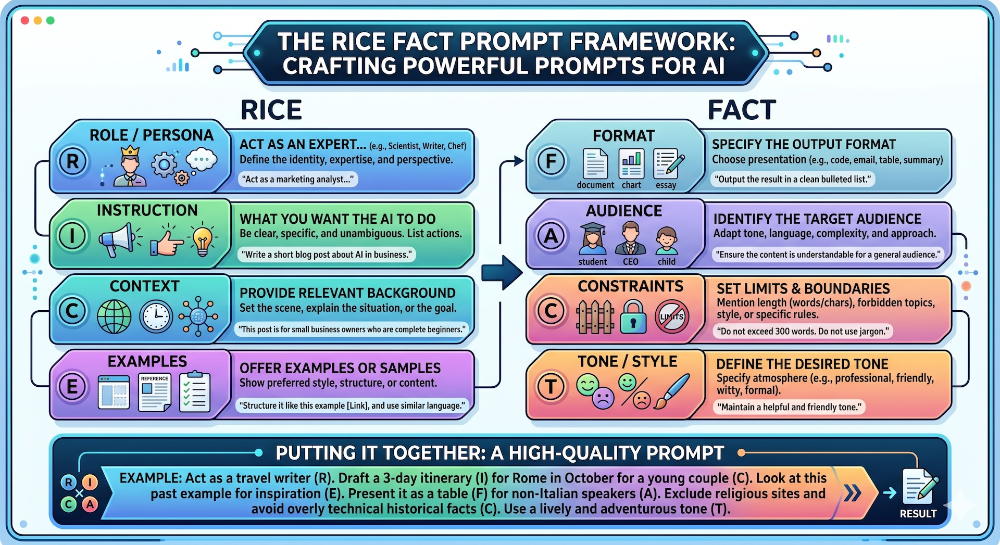
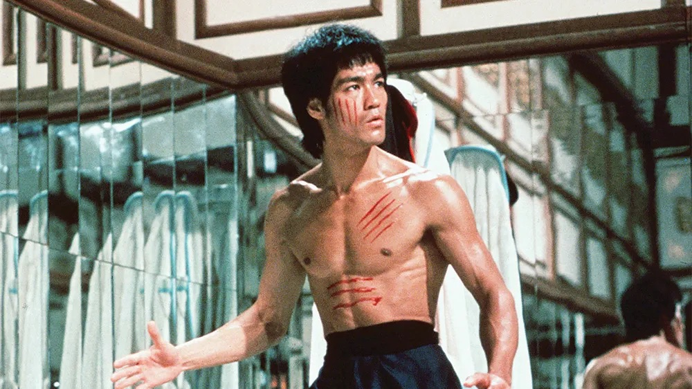

# AI For Accountants


This is a practical generative AI tutorial targeting accountants. It covers the following contents.

- Understanding Generative AI: How LLM and GenAI Works
- GenAI Risks and Ethics: Data Privacy, Human-in-the-loop Mindset
- The Accountant’s AI Toolkit: GenAI Market Landscape & Local LLM
- Mastering Prompt Engineering: AI-User Interaction & RICE FACT
- Moving Beyond Prompts: Create Reusable Systems/Rules

# Hello! My name is Sunny 🌞


[Sunny Ng](https://training.imagenation.com.hk/#sunny-ng)  
**Founder / Master Trainer** at [Image Nation](https://training.imagenation.com.hk)  
**Part-time Lecturer** at HKU, HKUSPACE, Education University of Hong Kong  
**Email**: sunny.ng@imagenation.com.hk or ngsanluk@hku.hk
**Website**: [https://training.imagenation.com.hk](https://training.imagenation.com.hk)

# Useful Keyboard Shortcuts

| Keyboard Shortcut | Description                                         |
| ----------------- | --------------------------------------------------- |
| `SHIFT` + `ENTER` | Move cursor to next line without sending out prompt |
| `CTRL` + Click    | Open a link in a NEW browser tab                    |
| `CTRL` + `Z`      | Undo last action                                    |
| `CTRL` + `C`      | Copy selected text                                  |
| `CTRL` + `V`      | Paste copied text                                   |
| `WIN` + `D`       | Show Windows Desktop                                |
| `CTRL` + `F`      | Search on the current page                          |

# Popular GenAI Tools

It is more effective to keep multiple browser tabs open for different AI tools at the same time that you can easily switch between them.

To open the following AI tools in a **NEW** browser tab, hold `CTRL` (`CMD` on Mac) when clicking the links below.

- [Gemini](https://gemini.google.com) - Google Gemini is a powerful, multimodal large language model developed by Google that can understand and process a wide range of information, including text, images, canvas (apps),audio, and video.
- [Perplexity](https://www.perplexity.ai) - AI search engine that provides concise answers with sources.
- [Microsoft Copilot](https://copilot.microsoft.com/) - Free Microsoft AI assisant.
- [Microsoft 365 Copilot](https://m365.cloud.microsoft/) - AI assistant integrated into Microsoft 365 apps.
- [Grok](https://grok.com) - AI tool for generating text and code.
- [Poe](https://poe.com) - Platform to access multiple AI models in one place.
- [Qwen](https://chat.qwen.ai) - Conversational AI for various tasks
- [Doubao](https://www.doubao.com) - Conversational AI for various tasks
- [DeepSeek](https://www.deepseek.com) - Conversational AI for various tasks (**NOT** a multi-modal tool)
- [LMArena](https://lmarena.ai) - Compare and explore different large language models.
- [Notion AI](https://www.notion.com) - Note-taking and productivity app with AI features.

# Design Tools

- [Canva](https://www.canva.com) - Graphic design platform with AI-powered tools. Great for PowerPoint Generation.
- [Napkin AI](https://www.napkin.ai/) - The visual AI for business storytelling.
- [newarc](https://www.newarc.ai/) - AI-powered fashion creative platform.

# Image Generation/Editing Tools

- [VisualGPT](https://visualgpt.io) - Photo Editor with AI / Image Generation
- [Yeri AI](https://yeri.ai/) - Open-source image generation model. Previously know as Stablediffusion.
- [ideogram](https://ideogram.ai/) - AI-powered image generation platform.

# Speech Synthesis / Audio Editing Tools

- [narakeet](https://www.narakeet.com/languages/chinese-text-to-speech/) - Easily Create Voiceovers Using Realistic Text to Speech
- [ElevenLabs](https://elevenlabs.io) - AI-powered text-to-speech platform.
- [Cleanvoice AI](https://cleanvoice.ai) - Audio editing tool that removes filler words, stutters, and long pauses from audio recordings.

# Video Generation Tools

- [Kling AI](https://app.klingai.com) - AI-powered video creation platform.
- [Hailuo AI](https://hailuoai.video) - AI-powered video creation platform.
- [Runway](https://runwayml.com) - AI-powered video editing and creation

# 3D Tools

- [Tripoai](https://studio.tripo3d.ai) - AI-powered 3D content creation platform.

# Mastering RICE FACT Effective Prompting

RICE FACT is a useful framework to help you structure your prompts effectively when using AI tools. It stands for Role, Instruction, Context, Example, Format, Action, Constraint, and Tone. By incorporating these components into your prompts, you can guide the AI to generate more accurate and relevant responses.  
There are other prompting frameworks such as **ICIO** (Instruction, Context, Input, Output), **SCQA** (Situation, Complication, Question, Answer) and **STAR** (Situation, Task, Action, Result), they all have their own advantages and disadvantages. RICE FACT is more comprehensive and flexible, allowing you to include various elements in your prompts to achieve better results.

**Beginner Pitfall**: AI beginner users tend to use simple **Instruction-only** prompts, which often lead to vague and irrelevant responses. By adding more prompt components such as Role, Context, Example, Format, Action, Constraint, and Tone, you can significantly improve the quality of the AI's responses.



**Tips 1**: You can just click the copy button to replicate the prompt in your AI ssistant. It's OKAY to include the RICE FACT tags in your prompt.  
**Tips 2**: In your future prompting, You DON'T actually have to specifically add these tags in your prompts. They are just there to help you better understand the prompt structure.  
**Tips 3**: It's NOT common to include all RICE FACT components in a single prompt.  
**Tips 4**: In some articles, A is referred as Action while some other articles refer to it as Audience. You can choose either one depending on the context of your prompt.

**Instrustion** only

```
Role        →
Instruction → Explain what GenAI is.
Context     →
Example     →
Format      →
Action      →
Constraint  →
Tone        →
```

---

**Instruction** + **Format**

```
Role        →
Instruction → Explain what GenAI is.
Context     →
Example     →
Format      → Use one sentence.
Action      →
Constraint  →
Constraint  →
```

---

**Role** + **Instruction** + **Format**

```

Role        → You are a secondary teacher.
Instruction → Explain what GenAI is.
Context     →
Example     →
Format      → Use one sentence.
Action      →
Constraint  →
Tone        →

```

---

**Role** + **Instruction** + **Format**

```

Role        → You are a kindergarten teacher.
Instruction → Explain what GenAI is.
Context     →
Example     →
Format      → Use one sentence.
Action      →
Constraint  →
Tone        →

```

---

**Role** + **Instruction** + **Context**

```

Role        → You are a tech trainer.
Instruction → Explain what GenAI is.
Context     → The target audience are non-technical executives.
Example     →
Format      →
Action      →
Constraint  →
Tone        →

```

---

**Instruction** + **Format**

```
Role        →
Instruction → Explain what GenAI is.
Context     →
Example     →
Format      → Use three bullet points.
Action      →
Constraint  →
Tone        →
```

---

**Instruction** + **Format** + **Constraint**

```
Role        →
Instruction → Explain what GenAI is.
Context     →
Example     →
Format      → Use three bullet points.
Action      →
Constraint  → Each bullet points not more than 15 words.
Tone        →
```

---

**Instruction** + **Example**

```
Role        →
Instruction → Generate 10 dummy customer records as below
Context     →
Example     → CustID, CustName, Email, Mobile, Address
Format      →
Action      →
Constraint  →
Tone        →
```

---

# Let's Practice Image Editing to Better Understand Effective Prompting

Although prompting for text generation is different from prompting for image generation, the underlying principles of effective prompting remain the same. By practicing image editing, you can gain a better understanding of how to structure your prompts effectively. Followed by that, you can apply the same principles to accounting related tasks and other AI tasks.

Let's first experience how VisualGPT make it so easy to edit images by just uploading you photo/image without any technical knowledge or photo editing knowledge.

Open the following page on VisualGTP to experience just by upload your image + one click, AI will do the difficult photoshop works that it previously takes hours to complete.

[https://visualgpt.io/room-cleaner](https://visualgpt.io/room-cleaner)
[](https://visualgpt.io/room-cleaner)

There are many photo editing tools on VisualGPT that works the same way - just upload your image and it does difficult photoshop works for you. The true is VisualGPT is dedicated the real image editing works to the AI engine. They have pre-written prompts for each photo editing effect that will be sent to the AI engine to generate the final image.

## Understanding Visual Design Language

You can also write your own prompts to instruct your own favorite AI to do the same tasks. Many AI assistants out there are multi-modal, meaning they can generate multiple forms of contents such as texts, images, videos, music and programming codes.

The key is one must understand visual design language so as to effective prompt AI to complete your image editing tasks. The more you practice, the better you will understand how to effectively prompt AI to complete your tasks. The same principles can be applied to accounting related tasks and other AI tasks.

## Let's Practice One More Using Our Own Prompt

You can feed image and ask Gemini to edit the image(s) based on your instructions. For example, you can ask Gemini to change the background of an image, add or remove certain elements, or apply specific filters to enhance the visual appeal of the image.

```
Turn this photo into a character figure.
Behind it, place a figure box with the character image printed on it,
and a computer showing the Blender modeling process on its screen.
In front of the box, add a round plastic base with the figure placed on it.
Use the figure's vinyl material.
Set the scene in home studio
```




## Image as Style Reference

You can also feed image as style reference and instruct Gemini to use it as target style to edit your own image in the same style.

## Reverse Engineering

In Visual GPT, you can use the **Image to Prompt** to reverse-engineer an image to texts description and then use the generated texts as prompt to create a new image. This is feeding an image to an AI model and asking it to use NPL to produce a text description of the image. That's why it's call reverse engineering.
